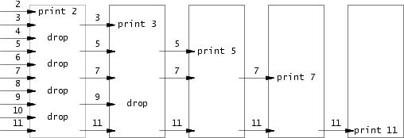

# sieve of Eratosthenes

Implement [sieve of Eratosthenes](https://en.wikipedia.org/wiki/Sieve_of_Eratosthenes) in different programming languages.

An illustration article can be found at https://swtch.com/~rsc/thread



## usage

To print the prime numbers from 1 to 10000:

### C
[](https://github.com/w3ntao/sieve-of-eratosthenes/actions/workflows/c.yml)
```
$ cd primes-c;
$ cmake -B build;
$ cmake --build build;
$ ./build/primes 10000
```

### C++
[](https://github.com/w3ntao/sieve-of-eratosthenes/actions/workflows/cpp.yml)
```
$ cd primes-cpp;
$ cmake -B build;
$ cmake --build build;
$ ./build/primes 10000
```


### Go
[](https://github.com/w3ntao/sieve-of-eratosthenes/actions/workflows/go.yml)
```
$ go run primes.go 10000
```
